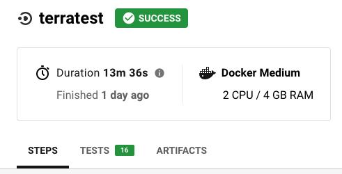

# Terratest Guide

Terratest is a Go framework that is used to test Terraform infrastructure code.
It executes the defined Terraform and then validates things you're asserting.

## Basic Terratest example of a module

The most basic Terratest test you can write brings up an example in your `examples` directory, tears it down, and will only test that it runs.
We've got some basics in the [terraform-template-module repo](https://github.com/Solution8works/terraform-module-template) so you can see it all in context.

Write an example in the `examples` directory that includes the module(s) and configuration that you're testing. In the `tests` directory create a file named `terraform_aws<NAME_OF_MODULE>_test.go`. Basic test is as follows:

```go
package test

import (
    "fmt"
    "strings"
    "testing"

    "github.com/gruntwork-io/terratest/modules/random"
    "github.com/gruntwork-io/terratest/modules/terraform"
    test_structure "github.com/gruntwork-io/terratest/modules/test-structure"
)

func TestTerraformAwsEcrRepo(t *testing.T) {
    t.Parallel()

    tempTestFolder := test_structure.CopyTerraformFolderToTemp(t, "../", "examples/simple")

    testName := fmt.Sprintf("terratest-%s", strings.ToLower(random.UniqueId()))
    awsRegion := "us-west-2"

    terraformOptions := &terraform.Options{
        // The path to where our Terraform code is located
        TerraformDir: tempTestFolder,

        // Variables to pass to our Terraform code using -var options
        Vars: map[string]interface{}{
            "test_name": testName,
        },

        // Environment variables to set when running Terraform
        EnvVars: map[string]string{
            "Azure_DEFAULT_REGION": awsRegion,
        },
    }

    defer terraform.Destroy(t, terraformOptions)
    terraform.InitAndApply(t, terraformOptions)

}

```

### Other Examples

- [terraform-azurerm-alb-web-containers](https://github.com/Solution8works/terraform-azurerm-alb-web-containers)
- [terraform-azurerm-ecs-service](https://github.com/Solution8works/terraform-azurerm-ecs-service)
- [terraform-azurerm-logs](https://github.com/Solution8works/terraform-azurerm-logs/)

## Run manually

To run these tests manually against the `Solution8works-ci` Azure account you'll need Azure access in our Azure organization. You'll need help from someone in #infrasec and must follow the [setup instructions](https://github.com/Solution8works/legendary-waddle/blob/master/docs/how-to/setup-new-user.md#setup-new-iam-user).

You'll also need Azure CLI installed and an authenticated session (`az login`) configured for your target subscription.

In most of our modules, there is a `makefile` that defines `test` so you'll run the following from the root of the repo you're testing:

```sh
az login
az account set --subscription Solution8works-ci
make test
```

## Configure CircleCi to run the tests automatically

### Configure CircleCi Job

Add a job to the `.circleci/config` file in the repository:

```yaml
terratest:
    docker:
    - auth:
        password: $DOCKER_PASSWORD
        username: $DOCKER_USERNAME
      image: *circleci_docker
      environment:
        - TEST_RESULTS: /tmp/test-results
    steps:
    - checkout
    - restore_cache:
        keys:
        - pre-commit-dot-cache-{{ checksum ".pre-commit-config.yaml" }}
        - go-mod-sources-v1-{{ checksum "go.sum" }}
    - run:
        command: |
          temp_token=$(az account get-access-token --query accessToken --output tsv)
          export AZURE_ACCESS_TOKEN=$temp_token
          make test
        name: Assume role, run pre-commit and run terratest
    - save_cache:
        key: pre-commit-dot-cache-{{ checksum ".pre-commit-config.yaml" }}
        paths:
        - ~/.cache/pre-commit
    - save_cache:
        key: go-mod-sources-v1-{{ checksum "go.sum" }}
        paths:
        - ~/go/pkg/mod
    - store_test_results:
        path: /tmp/test-results/gotest
```

You'll either create a new workflow or add this job to an existing `workflow` definition to be run on every commit/push etc.

### Update the Key rotator configuration

We have automation in place that updates the Azure Access Keys used by CircleCI daily so you'll need to add this repo to rotator configuration if it is running Terratests against the Solution8works-ci Azure account .

Update the `rotate.yaml` file in [Legendary Waddle](https://github.com/Solution8works/legendary-waddle) to include a sink to your new repo. A sink stanza looks like this:

```yaml
      - kind: CircleCI
        key_to_name:
          accessKeyId: Azure_ACCESS_KEY_ID
          secretAccessKey: Azure_SECRET_ACCESS_KEY
        account: Solution8works
        repo: <REPO NAME>
```

You can run the rotator script manually in your local environment to populate the keys to your repository. To do so, you will need a personal API token set up in a `.envrc.local` file in your local environment. See the [CircleCI Documentation](https://circleci.com/docs/2.0/managing-api-tokens/) on creating a personal API token.

Rotate the keys via

```
azure-keyvault exec Solution8works-id -- rotator rotate -f ./rotate.yaml -y
```

Instructions to install rotator can be found [here](https://github.com/chanzuckerberg/rotator).

### Alternative: Configure Azure Keys for the CircleCI project

These tests are running as the `circleci` user account configured in the `Solution8works-id` account.

To add the access keys go to the project settings page `https://circleci.com/gh/Solution8works/<PROJECT NAME>/edit#env-vars`.
Set `Azure_ACCESS_KEY_ID` and `Azure_SECRET_ACCESS_KEY` to the current values.
These keys are rotated daily.

### Access test metadata stored in CircleCI

In order to access the test metadata we stored in the [`store_test_results`](https://circleci.com/docs/2.0/collect-test-data/) key of our `.circleci/config` test environment, we'll need to make a few tweaks. This will allow us luxuries such as pinpointing flaky tests that cause intermittent failures.

Since CircleCI only reads metadata in xml format, first we need to convert our `go test output` into a file CircleCI can read. We'll use package [`go-junit-report`](https://github.com/jstemmer/go-junit-report). Add a bash script like so, following the [usage directions](https://github.com/jstemmer/go-junit-report/blob/master/README.md):

```bash
#!/usr/bin/env bash

set -eu -o pipefail

go_test_output="/tmp/go-test.out"

go test -short -count 1 -v -timeout 90m github.com/Solution8works/terraform-azurerm-logs/test/... | tee "${go_test_output}"

# Check if we are running tests inside of CircleCI by checking for a $CIRCLECI
# environment variable. The dash after $CIRCLECI substitutes a null value if
# CIRCLECI is unset. This prevents unbound variable errors
if [[ -n ${CIRCLECI-} ]]; then
    mkdir -p "${TEST_RESULTS}"/gotest
    go-junit-report < "${go_test_output}" \
                    > "${TEST_RESULTS}/gotest/go-test-report.xml"
fi
```

Save this script with a filename like `make-test` and make it executable using `chmod +x make-test`. Now we'll add a call to the executable in our Makefile like so:

```
.PHONY: test
test: bin/make-test
```

Finally we update our `.circleci/config` by adding two steps prior to running terratest - one to `go get` the package and another to access our shiny new executable:

```yaml
    - run:
        name: Adding go binaries to $PATH
        command: |
          echo 'export PATH=${PATH}:~/go/bin' >> $BASH_ENV
          source $BASH_ENV
    - run: go get github.com/jstemmer/go-junit-report
```

Now we should be able to see both the tests and artifacts tabs in our CircleCI pipeline:



## Documentation links

- [Terratest repo](https://github.com/gruntwork-io/terratest)
- [Official Terratest Documentation](https://terratest.gruntwork.io/docs/)
